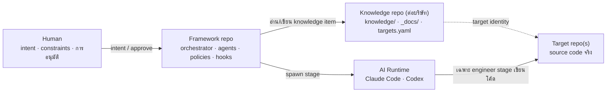

# software-team-agents

**Personal AI. Shared Knowledge. Common Process.**

Framework ชั้น process/workflow สำหรับทีมซอฟต์แวร์ ที่จัดระเบียบการทำงานร่วมกันระหว่าง Human กับ AI coding tools (Claude Code, Codex) — แต่ละคนใช้ AI/tool ของตัวเองได้ แต่ทั้งทีมทำงานบน Knowledge และ Process ชุดเดียวกัน

---

## คืออะไร

software-team-agents คือ process layer + orchestrator ที่:

- **จัดงานเป็น pipeline** ของ agent roles 10 ตัว (setup ครั้งเดียวต่อ project + BA → SA → PM → test-planner → DEV → QA → security → devops) แต่ละ role รับผิดชอบ artifact เดียว และส่งงานกันแบบ hand-off ที่มีเจ้าของชัดเจน
- **เก็บความรู้ของ project เป็น Knowledge กลาง** — ไฟล์ YAML หนึ่งไฟล์ต่อหนึ่ง fact ที่ทุกคนและทุก AI อ่าน/ใช้อันเดียวกัน
- **คุมขอบเขตและบังคับใช้กฎด้วย mechanism ไม่ใช่ความจำ** — hooks, path permissions, human approval gates, verification, rollback

มัน**ไม่ใช่ AI model** และไม่ได้สร้างมาแทน Claude Code หรือ Codex ให้มองว่า:

| ส่วน | หน้าที่ |
|---|---|
| Claude Code / Codex | execution runtime — เครื่องมือที่ลงมือทำงาน |
| **software-team-agents** | process/workflow layer — จัดว่าใครทำอะไร ต่อกันอย่างไร ตรวจอย่างไร |
| Knowledge | ความรู้ร่วมของทีม/project |
| Target | repository/project จริงที่ต้องการให้ AI ทำงาน |
| Human | ผู้กำหนด intent, constraints และผู้ตัดสินใจในจุดสำคัญ |

## ทำไมถึงสร้าง

ใช้ Claude Code / Codex แบบตรง ๆ ก็เขียนโค้ดได้ — ปัญหาอยู่ที่การทำงาน**เป็นทีม**:

- Context ของ AI อยู่แค่ใน session นั้น ๆ — คนละเครื่อง คนละ session เห็นข้อมูลไม่เดียวกัน ความรู้ project อยู่ในหัวคนและ AI memory ที่ไม่ share กัน
- ไม่มีเจ้าของชัดต่อ artifact — ใครเขียน requirement, ใครอนุมัติ design, ใคร mark task done ไม่มีใคร enforce
- งานเล็กกับงานใหญ่ถูก push ผ่าน process เดียวกัน หรือไม่มี process เลย
- การตัดสินใจสำคัญ (schema, business rule, deploy) ไม่ถูกบันทึกว่าใครตัดสิน เมื่อไหร่ บนข้อมูลอะไร

framework นี้แก้ด้วยการย้ายสิ่งเหล่านี้จาก "ความจำของคน/AI" ไปเป็น**ไฟล์ + process ที่บังคับใช้ได้จริง** โดยยังให้แต่ละคนเลือก runtime ของตัวเองได้

## สิ่งที่ระบบนี้เป็น / ไม่เป็น

| เป็น | ไม่เป็น |
|---|---|
| Process/workflow layer + orchestrator CLI | AI model หรือ AI service |
| Shared knowledge model ที่ version ด้วย git | Database server / SaaS / ระบบ cloud |
| Guard hooks ที่บังคับใช้กฎระดับ tool call | ระบบ replace Claude Code / Codex |
| Pipeline ที่ right-size ตามขนาดงาน | CI/CD system |

## Architecture

Three-Repo Architecture — แยกสามอย่างที่มี lifecycle ต่างกันออกจากกัน:



| Repo | เก็บอะไร | Lifecycle |
|---|---|---|
| **Framework** (repo นี้) | orchestrator, agent prompts, hooks, contracts, workflows, policies, stacks — pack เป็น npm package (`sta`) | อัปเดตผ่าน `sta upgrade` |
| **Knowledge** (ต่อบริษัท) | `knowledge/` (9 kinds), `_docs/`, `decisions/`, `targets.yaml` | commit + merge ผ่าน git โดยทีม |
| **Target** (ต่อ product) | source code จริง เช่น `sb-web-helper` | git flow ปกติของ project นั้น |

ผลที่ได้: **คนที่ไม่แตะโค้ด (BA / SA / PM / QA) clone แค่ Knowledge repo** — ไม่ต้อง clone Target ทุกตัว และ framework internals ไม่ติดเข้า git history ของ repo ลูกค้า

### โครงสร้าง Framework repo (ส่วนสำคัญ)

```
orchestrator/        ← CLI (`sta`) + state store + knowledge engine (Node/TypeScript, vitest)
.claude/agents/*.md  ← agent prompts 10 roles (+ .codex/agents/*.toml ฝั่ง Codex)
.claude/hooks/       ← guards: block-git, block-outside-repo, block-doc-rewrite,
                       block-path-permissions, require-green-before-stop, block-secret-leak
contracts/*.yaml     ← read/write/deny path globs ต่อ role
workflows/*.yml      ← 11 workflows: typo → feature/deploy (right-sizing)
policies/            ← กฎที่ทุก agent ใช้ร่วมกัน
stacks/              ← stack profiles (node, frontend, dotnet, java, python)
knowledge/           ← โครงสร้าง knowledge model (ดู knowledge/README.md)
planning/            ← TASKS / CHECKLIST / HANDOFF / UAT_KIT
```

## Workflow

Human เลือกประเภทงานผ่าน classification flags แล้ว orchestrator เดิน workflow ที่ right-size แล้วให้:

```bash
sta run --task-id T-1 --module demo --bug-fix --backend --autonomy edit
```

| งานเป็นแบบ | flag | workflow | chain |
|---|---|---|---|
| แก้คำ/สไตล์ | `--typo` | TRIVIAL | engineer เท่านั้น |
| bug fix ชัดเจน | `--bug-fix` | bugfix | DEV → QA (+security เมื่อ sensitive) |
| เพิ่ม/แก้ field/table | `--schema` | schema-change | SA → test-planner → DEV → QA → security |
| แก้ business rule | `--business-rule` | business-rule | BA → SA → DEV → QA |
| feature/module/project ใหม่ | `--new-feature` | feature | BA → SA → PM → test-planner → DEV → QA (full chain) |
| deploy/migration production | `--deploy` | deploy | + devops, gated |

(ทั้งหมด 11 workflows ใน `workflows/` — phase ไหน optional ถูกประกาศในไฟล์ workflow เอง เช่น `when: touchesBackend`)

หลักการ:

- **Right-size** — งานเล็กไม่วิ่ง ten-stage pipeline แต่ห้าม skip stage ที่งานนั้นต้องใช้จริง
- **Human approval gates** — gate สำคัญหยุดรอคนจริง: requirement interview, schema confirmation, QA ไม่ผ่าน, security finding Critical/Important, deploy/migration จริง และ cutover ของ knowledge-migration (ต้อง `--confirm I_CONFIRM_MIGRATION`) การอนุมัติถูกเก็บเป็น record (type/status/who/when) — การ reject คือ record ที่ block งาน ไม่ใช่ flag
- **QA** — FULL round ครบทุก task เท่านั้นที่ปิด phase ได้ / TARGETED re-check เฉพาะจุด พร้อมแจ้งสิ่งที่ไม่ได้ cover ถ้า project ไม่มี automated tests QA รายงาน `Unverified Behaviour` ไว้ชัดเจน
- **Failure/recovery** — Retry (รอบ owner) · Recover (ถอยไป stage ก่อนหน้า) · Rollback (กลับสู่ state ยืนยันล่าสุด หรือ restore จาก `.sta/backups/` ผ่าน `rollback`) · Escalate (ให้คนแก้) · Abort (หมด retry budget) — ดู `escalation-policy.yaml`

## Shared Knowledge

Knowledge ไม่ใช่ "AI memory" — มันคือข้อมูลร่วมของทีมที่มีโครงสร้างและ lifecycle:

- **หนึ่ง YAML file ต่อหนึ่ง fact** ภายใต้ `knowledge/<module>/<kind>/<ID>.yaml` — git merge ไม่ชนเว้นแต่สองคนแก้ item เดียวกันจริง และ `version` field คือกลไก conflict (แก้เนื้อหา = ต้อง bump)
- **9 kinds หนึ่ง shape**: requirement (`REQ-`) · business-rule (`RULE-`) · domain (`DOM-`) · architecture (`DES-`) · api (`API-`) · db-schema (`DB-`) · decision (`ADR-`) · task (`BE-/FE-`) · test (`TEST-`) — query ข้าม kind ได้ในคำสั่งเดียว
- **Source/provenance/freshness** — ทุก item อ้าง `sources[]` (type, locator, `captured_at`, digest ของ slice ที่อ่าน) freshness วัดจาก digest ก่อนอายุ: source เปลี่ยน = stale ทันทีไม่ว่าไฟล์จะเขียนเมื่อไหร่
- **Relations + legality matrix** — `refines/implements/verifies/depends-on/constrains/supersedes/conflicts-with/derived-from` ผูกไม่ถูกกฎ = ถูกรายงานโดย `check()`
- **Ownership & status** — `owner` ต่อ role, status `draft → reviewed → approved → deprecated`; **approve ได้เฉพาะคน** (`sta roles approve`), agent เขียนไฟล์ lane (`knowledge/_roles/**`) ไม่ได้ทุกกรณี
- **Role-based context** — `knowledge-policy.yaml` กำหนด field ที่แต่ละ role เห็น; ทุก result ที่ retrieve บอกด้วยว่าอะไรถูก withhold (ของที่ถูกซ่อนกับของที่ไม่มีต้องแยกกัน)
- **Conflict** — ตรวจใหม่ทุกรอบ ไม่เก็บ list; เก็บเฉพาะ**คำตัดสินของคน**ใน `_conflicts/CONF-*.yaml`

State ของ run (`.workflow/state.db`, SQLite) แยกจาก knowledge โดยเจตนา — local, gitignored, ไม่ sync ข้ามเครื่อง

รายละเอียด: [`knowledge/README.md`](knowledge/README.md)

## Multi-Target และ Multi-Machine

Logical identity ของ Target ไม่ผูกกับ physical path — แต่ละเครื่อง map path ของตัวเอง:

`targets.yaml` (shared, อยู่ใน Knowledge repo):

```yaml
schema_version: 1
targets:
  - target_id: sb-web-helper
    name: SB Web Helper
    remote_url: https://github.com/Jabjai-Corporation/sb-web-helper.git
    status: active
```

`.workflow/targets.local.yaml` (machine-local, **ไม่ commit**):

```yaml
schema_version: 1
targets:
  sb-web-helper:
    path: D:\src\sb-web-helper     # เครื่อง A (Windows)
    # path: /Users/b/projects/sb-web-helper   # เครื่อง B (macOS)
```

ทั้งสองเครื่องทำงานกับ Target เดียวกัน (`sb-web-helper`) แต่ physical path เป็น config ของแต่ละเครื่อง preflight ตรวจว่า remote ของ local checkout ตรงกับ `remote_url` canonical — ไม่ตรง = reject พร้อมเหตุผล

## Runtime ที่รองรับ

| Runtime | สถานะ |
|---|---|
| **Claude Code** | ✅ implemented + verified กับ runtime จริง (pilot กับ project จริง, capability detection probe กับ CLI ที่ติดตั้งจริง) |
| **Codex** | ⚠️ **partial** — adapter มีอยู่แต่ยังไม่เคย verify กับ install จริง; การ parse usage/cost/model ยังเป็น assumption ที่ระบุไว้ชัดในโค้ด |

Agent prompts เตรียมทั้งฝั่ง `.claude/agents/*.md` และ `.codex/agents/*.toml` ทุก run ของ orchestrator วิ่งผ่าน Claude Code adapter (`codexAdapter` มีอยู่และเขียน test ครบ แต่ยังไม่มีตัวเลือก runtime ระดับ CLI) — การเปลี่ยน runtime เป็นเรื่องภายใน adapter interface ไม่กระทบ process/knowledge ข้อจำกัดสำคัญ: การรัน unattended ต้องใช้ `--autonomy edit` หรือ `full` (default `propose` จะติด permission prompt ที่ไม่มีคนกดใน headless run)

## Installation

Prerequisites: **Node.js ≥ 20**, **Git**, **Claude Code CLI** (login แล้ว) — ตรวจด้วย `node --version`, `claude --version`

> แค่อยากเปิด Claude แล้วใช้ agent ทำงานทันที (ba/sa/uxui/dev) โดยไม่ setup เอง — ข้ามไป [`START.md`](START.md) ได้เลย

**วิธีที่ 1 — clone framework repo (สำหรับคนที่มีสิทธิ์เข้าถึง):**

```bash
cd <where you keep tools>
git clone https://github.com/<org>/software-team-agents.git
cd software-team-agents/orchestrator
npm ci && npm run build        # build orchestrator → dist/
npm run build:templates        # snapshot templates/ + manifest.json
```

เรียก CLI ได้เป็น `node orchestrator/dist/cli.js <command>`

**วิธีที่ 2 — npm package (tarball, ยังไม่เปิด publish ขึ้น registry):**

```bash
npm pack <path ไป repo root>          # → software-team-agents-0.1.0.tgz
npm i -g ./software-team-agents-0.1.0.tgz   # ได้ command `sta`
```

## Quick Start

คำสั่งย่อ `sta` ใช้ได้เมื่อ install แบบ npm package — ถ้าใช้แบบ clone ให้แทนด้วย `node orchestrator/dist/cli.js`

การ initialize installation (สร้าง config ของ installation นี้) เลือก mode ชัดเจน:

```bash
sta init --mode three-repo          # หรือ legacy-project สำหรับ project ที่ยังไม่แยก repos
```

ต่อจาก Installation — flow ครบอยู่ใน [`TEAM_SETUP_V1.md`](TEAM_SETUP_V1.md) ฉบับย่อ:

```bash
# 1) Clone Knowledge repo ของทีม (ครั้งเดียวต่อเครื่อง)
git clone https://github.com/<org>/<company>-knowledge.git C:\src\<company>-knowledge

# 2) Bind เครื่องนี้เข้ากับ Knowledge root (validate ให้เลย — ผิดจะ reject พร้อมเหตุผล)
node orchestrator/dist/cli.js configure knowledge-root C:\src\<company>-knowledge

# 3) (DEV เท่านั้น) ลงทะเบียน Target ใน targets.yaml + map path local
#    ดูตัวอย่าง config ในหัวข้อ Multi-Target ด้านบน

# 4) ตรวจความพร้อม — ✓ ครบ + usable = Ready
node orchestrator/dist/cli.js doctor --project-root C:\src\<company>-knowledge

# 5) Task แรก (DEV)
node orchestrator/dist/cli.js run --task-id T-1 --module demo --bug-fix --backend \
  --autonomy edit --backend-target sb-web-helper \
  --project-root C:\src\<company>-knowledge
node orchestrator/dist/cli.js status T-1 --project-root C:\src\<company>-knowledge
```

BA / SA ทำงานผ่าน lane commands:

```bash
sta roles review REQ-101 --as business-analyst    # draft → reviewed (มี checklist)
sta roles approve REQ-101 --by "<ชื่อคน>"          # reviewed → approved (คนเท่านั้น)
sta roles signoff ba --by "<ชื่อคน>"               # ปิด gate ของ lane ตัวเอง
sta roles inbox sa                                # lane นี้มีอะไรต้องดู
sta approve T-1                                   # resolve human gate ของ task
```

สคริปต์เดินจริงครบทุก scenario (S0–S5): [`planning/v1/UAT_KIT_V1.md`](planning/v1/UAT_KIT_V1.md) (internal, gitignored — มีเฉพาะในเครื่องผู้พัฒนา)

## ตัวอย่างการใช้ในทีม

Developer A (Windows) และ Developer B (macOS) ทำงานกับ Target เดียวกัน:

| | Developer A | Developer B |
|---|---|---|
| Runtime | Claude Code | Claude Code |
| Knowledge repo | `D:\src\acme-knowledge` | `/Users/b/projects/acme-knowledge` |
| `configure knowledge-root` | ชี้ path ของเครื่อง A | ชี้ path ของเครื่อง B |
| Target identity | `web-helper` (จาก `targets.yaml` ตัวเดียวกัน) | `web-helper` |
| Local mapping | `D:\src\web-helper` | `/Users/b/projects/web-helper` |
| Process/workflow | เดียวกันทั้งหมด | เดียวกันทั้งหมด |

> ผู้ใช้ Codex จะทำงานใน process/knowledge ชุดเดียวกันได้เมื่อ adapter ผ่านการ verify — ตอนนี้ยัง partial (ดูหัวข้อ Runtime)

BA ของทีม clone เฉพาะ Knowledge repo — เขียน requirement เป็น knowledge item, review/approve/signoff ผ่าน `sta roles` โดยไม่ต้องมี source code ของ Target อยู่ในเครื่อง

## Verification และ Human Gates

สิ่งที่ implementation บังคับใช้จริง (hook-level, ไม่ใช่แค่ prompt):

- **block-git** — agent รัน state-changing git ไม่ได้ (read-only ได้)
- **block-outside-repo** — ทุก write resolve อยู่ใน repo เท่านั้น
- **block-path-permissions** — เขียนได้เฉพาะ path ที่ `contracts/<role>.yaml` ให้สิทธิ์
- **require-green-before-stop** — engineer ส่งงานต่อไม่ได้ถ้า typecheck/lint แดง
- **block-secret-leak** — ไฟล์ที่ run แก้ห้ามมี hardcoded secret (`.env.example` รวมอยู่ด้วย)
- **Guards ถูกเทสต์** — `node .claude/tests/run.js` (139 cases); guard ที่ syntax error ต้อง fail loud ไม่ใช่ fail open
- **Validation ทั้งระบบ** — `--check-*` flags 15 ตัว (contracts, layout, workflows, knowledge, doc-structure, review-separation, installation, ...) + `doctor` รวม 9 checks แบบ read-only
- **Audit trail** — `sta audit <task-id>` แสดง WHO/WHAT/WHEN/WHY/INPUT/OUTPUT/DECISION ทั้ง task
- **Backup/Rollback** — ทุก upgrade/migrate snapshot ไป `.sta/backups/` ก่อนเขียน; `list-backups` + `rollback` คืนได้ทั้งไฟล์และ manifest

ข้อจำกัดที่ยอมรับ: คำว่า secure หรือ production-safe **ไม่ถูก claim** — ระบบนี้บังคับใช้กฎที่ประกาศไว้เท่านั้น

## Project Status

สถานะ ณ 2026-08-22 (ตัวเลขจริงจาก `planning/HANDOFF_V1.md` §27):

- **Three-Repo scope: 49/49 tasks ✅** (รวม migration ของ project จริง — verify PASS 162 items, cutover แล้ว)
- **Core checklist: 45/48** — เหลือ T117 (resume หลัง quota reset) และ T119 (UAT กับทีมจริง — kit พร้อม, รอทีม)
- Test suite: **1829 passed** · hook/script harness 139 cases · build/typecheck เขียว
- **ยังไม่ tag v1.0.0** — release gate เป็นงานของมนุษย์: T117 ตัวเลขสะอาด → T119 UAT sign-off → commit knowledge repo → ตัดสิน publish npm → full CI บน PR → tag

รายละเอียด: [`planning/v1/CHECKLIST_V1_THREE_REPO.md`](planning/v1/CHECKLIST_V1_THREE_REPO.md) · [`planning/v1/CHECKLIST_V1.md`](planning/v1/CHECKLIST_V1.md) · [`planning/v1/HANDOFF_V1.md`](planning/v1/HANDOFF_V1.md) (ไฟล์เหล่านี้เป็นเอกสาร planning ภายใน — gitignore ไว้ ไม่ได้แถมมากับ repo ที่ clone)

## ข้อจำกัดของ V1

- **Codex runtime partial** — ยังไม่เคยรันจริงกับ install จริง UAT ครอบเฉพาะ Claude Code
- **Contract write-globs จำกัด** — pattern ปัจจุบันครอบ `src/lib/**`, `server/**`, `app/api/**`, `prisma/**` ฯลฯ app code นอกแพทเทิร์นนี้ engineer แก้ไม่ได้ (hook บล็อก) — ต้องปรับ contract ให้ตรงโครงสร้าง project จริงก่อนใช้
- **Unattended run ต้อง `--autonomy edit\|full`** — default (`propose`) ติด permission prompt headless
- **Git เป็น transport เดียว** — ไม่มี real-time collaboration; คนที่ไม่ใช้ git ใช้ระบบไม่ได้เต็มรูปแบบ; knowledge history ต้องมี git
- **Conflict detection ยังเป็น heuristic แคบ** — จับ model/endpoint/term ซ้ำ ไม่ใช่ semantic contradiction
- **Automated tests ของ Target เป็น opt-in** — ไม่มี suite = QA ตรวจด้วยการอ่านโค้ด + typecheck/lint/build ซึ่งแยก correct จาก incorrect ไม่ได้
- **Known issues ที่บันทึกไว้** — engineer fail ก่อนเริ่ม pipeline ยังคืบ cursor; weekly quota ตัด session กลางทาง (task resume ได้หลัง reset)
- **ยังไม่ publish ขึ้น npm registry** — distribution ผ่าน git clone หรือ npm pack tarball

## Roadmap

หลัง V1 — สั้น ๆ ตามลำดับ:

1. ใช้งาน V1 กับงานจริง (dogfood) และเก็บ friction จาก UAT
2. วัดและลด QA/token cost
3. สำรวจ native/official capabilities และ open standards ของ runtime แต่ละตัว
4. เปลี่ยน custom infrastructure ไปใช้ official solution เมื่อพิสูจน์แล้วว่าดีกว่า

หลักการ: **Keep the process. Prefer official plumbing.**

## Development / Contributing

```bash
cd orchestrator
npm ci
npm test                 # vitest (1829 tests)
npm run typecheck
npm run build            # tsc → dist/
npm run build:templates  # snapshot templates/ + manifest.json
node ../.claude/tests/run.js   # hook/script self-test — ต้องเขียวเสมอถ้าแตะ hooks/scripts
```

- CI: [`.github/workflows/agent-framework-ci.yml`](.github/workflows/agent-framework-ci.yml) รัน self-test + 15 release-gate `--check-*` flag บนทุก PR
- โครงสร้าง directory ถูกประกาศใน [`layout.yaml`](layout.yaml) และตรวจด้วย `--check-layout` — เพิ่ม folder ใหม่ต้องประกาศก่อน
- เอกสารกฎ: [`policies/`](policies/) · machine-readable half ของ agent: [`contracts/`](contracts/)
- เอกสาร planning/task (internal, gitignored): [`planning/v1/TASKS_V1_THREE_REPO.md`](planning/v1/TASKS_V1_THREE_REPO.md) · handoff: [`planning/v1/HANDOFF_V1.md`](planning/v1/HANDOFF_V1.md)

## License

ยังไม่มีไฟล์ LICENSE — package เป็น `private` ใช้ภายในองค์กร
